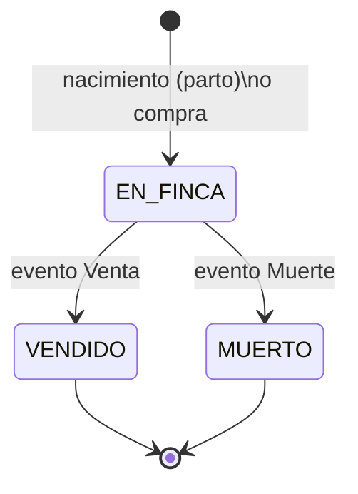
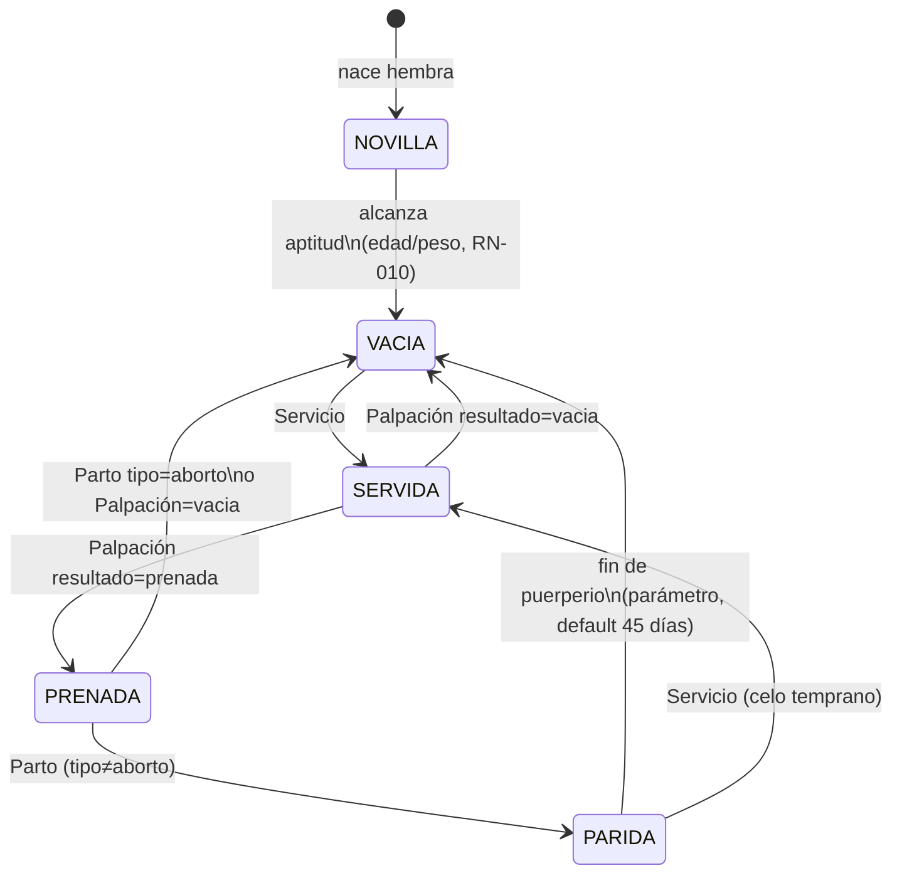

# GanaWeb — Arquitectura Funcional (v1.0)

> Especificación funcional del dominio. Complementa (no reemplaza) a:
> `schema_v3_corregido.sql` (estructura de datos), `design_brief_app_ganadera.md`
> (páginas y UX), `ganaweb-design.md` (sistema visual) y
> `kpis_reportes_ganaderos.sql` (queries de referencia).
>
> **Orden de precedencia ante conflicto**: 1) este documento (comportamiento),
> 2) el esquema v3 (estructura), 3) el brief (presentación). Si un agente de IA
> o desarrollador encuentra una contradicción, la reporta; no la resuelve en
> silencio.
>
> Convención: las reglas se identifican como RN-xxx (negocio), PE-xxx
> (permisos), TR-xxx (transiciones) y son citables en código, tests y PRs.

---

## 1. Modelo de permisos (RBAC)

### 1.1 Entidades (esquema v3)

| Tabla | Rol en el modelo |
|---|---|
| `usuarios_roles` | Roles nombrados, configurables por el cliente. `es_sistema=1` = rol semilla protegido |
| `usuarios_permisos` | Catálogo de permisos atómicos: `modulo` + `accion` (único) |
| `roles_permisos` | Qué permisos otorga cada rol |
| `usuarios_fincas` | A qué fincas tiene acceso el usuario (sin fila = sin acceso) |
| `usuarios_roles_asignacion` | Rol del usuario **por finca** (`finca_id`); `finca_id NULL` = rol global de plataforma |

### 1.2 Catálogo de módulos y acciones (semilla)

Acciones estándar: `ver`, `crear`, `editar`, `anular`, `inactivar`,
`exportar`, y `eliminar` (borrado FÍSICO — existe solo donde el dominio lo
permite; hoy únicamente `animales:eliminar`, ver especificación CRUD
Animales CA-DEL-001..009: procede solo sin eventos, con auditoría).

| Módulo | Notas |
|---|---|
| `animales` | Ficha, listado, creación por nacimiento/compra |
| `eventos_reproductivos` | Servicios, palpaciones, partos |
| `eventos_productivos` | Pesos, producción láctea |
| `sanidad` | Aplicaciones, revisiones, almacén |
| `movimientos` | Reubicaciones, ventas, muertes |
| `reportes` | Consulta y exportación de KPIs |
| `configuracion` | Maestros y parámetros de la finca |
| `fincas` | Crear finca, editar datos de la finca, invitar usuarios |
| `usuarios` | Gestión de usuarios y roles (típicamente global) |

### 1.3 Roles semilla (`es_sistema = 1`)

| Permiso → / Rol ↓ | Administrador | Mayordomo | Veterinario | Solo lectura |
|---|---|---|---|---|
| animales: ver/crear/editar | ✓ | ✓ | ver | ver |
| animales: eliminar (físico, CA-DEL) | ✓ | autoservicio 24h (CA-DEL-008) | — | — |
| eventos_reproductivos: * | ✓ | crear/ver | ✓ | ver |
| eventos_productivos: * | ✓ | ✓ | ver | ver |
| sanidad: * | ✓ | crear/ver | ✓ | ver |
| movimientos: * | ✓ | crear/ver | — | ver |
| movimientos: anular | ✓ | — | — | — |
| reportes: ver/exportar | ✓ | ver | ver | ver |
| configuracion: * | ✓ | — | — | — |
| fincas: crear/editar | ✓ | — | — | — |

Los nombres de rol son editables; **la matriz de permisos es lo que gobierna**.

### 1.4 Políticas

- **PE-001** — La UI y el servidor deciden por **permiso**, nunca por nombre de
  rol. Los nombres de rol no son contrato (el cliente los renombra).
- **PE-002** — Toda server function revalida el permiso en servidor. El gating
  de UI es cortesía, no seguridad.
- **PE-003** — Los permisos efectivos se resuelven **por finca activa**: unión
  de permisos de los roles asignados en esa finca + roles globales
  (`finca_id NULL`).
- **PE-004** — Offline: los permisos viajan en la réplica local con el último
  sync y siguen vigentes sin conexión. Una revocación surte efecto en el
  próximo sync; los registros creados en el intervalo se aceptan si el permiso
  era válido **al momento de crear** (timestamp del dispositivo), y se marcan
  para revisión si no.
- **PE-005** — Roles con `es_sistema=1` no se eliminan ni se les puede retirar
  `configuracion:*` al último administrador de una finca (siempre debe existir
  ≥1 administrador por finca).
- **PE-006** — Auditoría: todo insert de evento lleva `usuario_creado_por`
  NOT NULL en la práctica (la app nunca lo omite, aunque el esquema lo permita
  por compatibilidad de migración).
- **PE-007** — Registro con código de finca: crea `usuarios_fincas` + asigna el
  rol default de invitación configurado en `config_parametros_finca`
  (`codigo='rol_invitacion_default'`, semilla: Mayordomo). Sin código: usuario
  sin fincas, pantalla de espera "pide a tu administrador que te invite".

---

## 2. Máquina de estados del animal

Un animal tiene **tres dimensiones de estado independientes**. Confundirlas es
el error de modelado más común; se definen por separado:

1. **Ciclo de vida** (`estado_animal_key`): dónde está respecto a la finca.
2. **Categoría reproductiva** (`categoria_reproductiva`): solo hembras; estado
   del ciclo reproductivo. **Derivada de eventos, jamás editada a mano.**
3. **Etapa productiva** (derivada, no persistida): cría/levante/adulto según
   edad y `config_rangos_edades`. Es una *clasificación calculada* para
   listados y reportes, no un estado con transiciones.

Además: `ind_descartado` es una **marca de decisión** ("seleccionado para
descarte"), no un estado — el animal marcado sigue operando normal hasta su
venta o muerte.

### 2.1 Ciclo de vida

- **TR-001** — `VENDIDO` y `MUERTO` son terminales y mutuamente excluyentes.
  Un animal con venta registrada no admite muerte, y viceversa (RN-020).
- **TR-002** — Los animales terminales conservan `activo=1` (son histórico
  consultable); se excluyen de listados operativos por `estado`, no por
  `activo`. `activo=0` se reserva para el soft-delete de errores de captura.
- **TR-003** — Anular la venta/muerte (permiso `movimientos:anular`) devuelve
  al animal a `EN_FINCA` y queda en el histórico de estado.

### 2.2 Categoría reproductiva (hembras)

Reglas de transición:

- **TR-010** — La categoría **solo** cambia por eventos (servicio, palpación,
  parto) o por el job diario de puerperio. No existe edición manual; si el
  dato real difiere, se corrige registrando el evento que faltó.
- **TR-011** — Palpación `resultado=dudoso` **no** transiciona; deja la
  categoría como está y genera tarea de re-palpación a +30 días.
- **TR-012** — Un `Servicio` sobre una `PRENADA` no transiciona y dispara
  advertencia bloqueante suave (se puede confirmar con motivo — cubre el caso
  de preñez mal diagnosticada).
- **TR-013** — Machos y pajuelas: `categoria_reproductiva='no_aplica'` siempre.
- **TR-014** — El campo en `animales` es un **cache**: la fuente de verdad es
  la secuencia de eventos. Recalcularlo desde eventos debe dar el mismo valor
  (propiedad verificable por test).

### 2.3 Etapa productiva (derivada)

`edad = hoy − fecha_nacimiento` evaluada contra `config_rangos_edades`
(filtrado por sexo). Semilla sugerida: Cría (0-8 m), Levante (8-18 m),
Novilla/Torete (18-30 m), Adulto (30+ m). Solo clasifica; no restringe
eventos por sí misma (las restricciones son las RN explícitas).

---

## 3. Reglas de negocio críticas

### Identidad y datos base

- **RN-001** — `codigo` de animal es único por finca (constraint) e inmutable
  tras el primer evento registrado; antes, editable con permiso
  `animales:editar`.
- **RN-002** — Fechas de evento: nunca futuras (excepción única:
  `proxima_dosis`), nunca anteriores a `fecha_nacimiento` ni a
  `fecha_compra` del animal.
- **RN-003** — Todo evento requiere animal `EN_FINCA` al momento de la fecha
  del evento. Excepción: eventos con fecha anterior a la venta/muerte
  (captura tardía) se aceptan con advertencia.

### Reproducción

- **RN-010** — Servicio: solo hembras con categoría `VACIA`, `PARIDA` o
  `SERVIDA` (repaso). Aptitud mínima: edad ≥ parámetro
  (`edad_minima_servicio_meses`, default 18) **o** peso ≥ parámetro
  (`peso_minimo_servicio_kg`, default 280) — advertencia si no cumple,
  bloqueo solo si es `NOVILLA` sin ninguno de los dos.
- **RN-011** — Servicio tipo `monta` exige `padre_id` (macho `es_de_monta`);
  tipo `inseminacion` exige `pajuela_id` + `inseminador_id`; tipo
  `transferencia_embrion` exige `donadora`.
- **RN-012** — La IA descuenta `dosis` de `pajuelas_inventario`. El stock
  **puede quedar negativo** (RN-041) y genera alerta, nunca bloquea el
  registro en campo.
- **RN-013** — Palpación con `resultado=prenada` marca `efectivo=TRUE` en el
  **último servicio abierto** (efectivo IS NULL) de la vaca; `vacia` lo marca
  `FALSE`. Sin servicio abierto: la palpación se acepta y queda huérfana con
  advertencia (dato real > dato completo).
- **RN-014** — Parto: exige categoría `PRENADA` (forzable con permiso
  `eventos_reproductivos:editar` + motivo). `machos + hembras + muertos ≥ 1`.
  `tipo=aborto` ⇒ los tres contadores pueden ser 0.
- **RN-015** — Crías creadas desde un parto heredan: `madre_id`, `padre_id`
  del servicio origen, `finca_id`, ubicación de la madre, y generan `pesos`
  tipo `nacimiento` si se capturó peso. Vínculo en `partos_crias`.
- **RN-016** — Validación blanda: dos partos de la misma vaca con < 200 días
  de diferencia ⇒ advertencia (probable error de captura), no bloqueo.

### Producción y manejo

- **RN-020** — `ventas` y `muertes` son mutuamente excluyentes por animal y
  ambas cierran el ciclo de vida (TR-001). Venta exige `motivo_venta_id`;
  muerte exige `causa_muerte_id`. Ambas generan `pesos` tipo `venta` si se
  capturó peso.
- **RN-021** — Producción láctea: solo hembras con parto previo (lactancia
  vigente = último parto hace ≤ parámetro `dias_max_lactancia`, default 305,
  advertencia si excede). Único por animal+fecha (constraint). El
  multiplicador "× N días" del formulario **se expande a N filas**, una por
  fecha — nunca se persiste el multiplicador.
- **RN-022** — Reubicación: escribe `animales_ubicacion_historico` y actualiza
  el cache (`potrero_id`/`sector_id`/`lote_id`/`grupo_id`) del animal. La
  jerarquía es Finca → Potrero → Sector; Lote y Grupo son agrupaciones
  transversales (un animal puede tener potrero Y lote Y grupo a la vez).

### Sanidad e inventario

- **RN-040** — Aplicación sanitaria: guarda `precio_dosis` como **snapshot**
  del catálogo al momento de aplicar (el costeo histórico no cambia si cambia
  el precio).
- **RN-041** — El stock disponible es **calculado**
  (`Σ almacen_entradas.dosis − Σ aplicaciones.dosis`, vista
  `inventario_sanitario`), nunca un campo mutable. Puede quedar negativo por
  registros offline concurrentes; el negativo es una alerta de reconciliación,
  no un error.
- **RN-042** — `proxima_dosis` genera automáticamente una tarea/notificación
  (tipo `refuerzo_vacuna`) con `dias_anticipacion` de las preferencias del
  usuario. La tarea se auto-completa si se registra una aplicación posterior
  del mismo producto al mismo animal.

### Maestros y operaciones masivas

- **RN-050** — Ningún registro de maestro referenciado por eventos se elimina:
  se inactiva (`activo=0`). Inactivo = no aparece en selects de captura, sí en
  históricos y reportes.
- **RN-051** — Anular un `registro_grupal` (permiso `movimientos:anular` o el
  del módulo correspondiente) marca `anulado_en` y anula lógicamente TODAS sus
  filas hijas en una transacción. Las filas anuladas se excluyen de KPIs y
  stock. No hay edición parcial de un grupo anulado.
- **RN-052** — Toda operación de captura acepta 1..N animales; N>1 exige
  cabecera en `registros_grupales` con `total_animales` = filas hijas creadas.

### Offline y sincronización

- **RN-060** — Validaciones **duras** offline: solo las verificables con datos
  locales (tipos, fechas, categoría cacheada). Las de unicidad/consistencia
  global (código duplicado creado en dos dispositivos) se resuelven en el
  sync: gana el primero en llegar, el segundo va a la bandeja "Pendientes de
  revisión" — **nada se descarta en silencio**.
- **RN-061** — Resolución de conflictos de estado: ubicación y salud por
  last-write-wins sobre el timestamp del evento; ciclo de vida por severidad
  (`MUERTO` > `VENDIDO` > `EN_FINCA`) ante timestamps cercanos.

---

## 4. Eventos de dominio

Patrón único: **todo evento es un insert append-only** + fila en `sync_outbox`
+ efectos derivados idempotentes (recalcular caches, stock, tareas). Los
efectos se implementan de forma que re-aplicar el mismo evento (mismo UUID) no
duplique nada.

| Evento | Escribe en | Muta (cache) | Dispara | Offline |
|---|---|---|---|---|
| CrearAnimalNacimiento | animales, partos_crias, pesos(nacimiento) | — | — | ✓ |
| CrearAnimalCompra | animales, pesos(compra) | — | — | ✓ |
| RegistrarPeso | pesos | — | — | ✓ |
| RegistrarServicio | servicios | categoria→SERVIDA (TR); pajuelas_inventario | alerta RN-012 si aplica | ✓ |
| RegistrarPalpacion | palpaciones | categoria (TR-010); servicios.efectivo (RN-013) | tarea re-palpación si dudoso (TR-011) | ✓ |
| RegistrarParto | partos (+crías via CrearAnimalNacimiento) | categoria→PARIDA/VACIA | notificación parto | ✓ |
| RegistrarProduccion | producciones_lacteas (N filas) | — | — | ✓ |
| AplicarProductoSanitario | aplicaciones_sanitarias | stock (calculado) | tarea refuerzo (RN-042); alerta stock bajo | ✓ |
| RegistrarRevisionVeterinaria | revisiones_veterinarias | — | si celo_presentado: sugerir servicio | ✓ |
| MoverUbicacion | animales_ubicacion_historico | potrero/sector/lote/grupo del animal | — | ✓ |
| VenderAnimal | ventas, pesos(venta) | estado→VENDIDO | notificación | ✓ |
| RegistrarMuerte | muertes | estado→MUERTO | notificación | ✓ |
| RegistrarCondicionCorporal | animales_condicion_corporal | — | — | ✓ |
| AnularRegistroGrupal | registros_grupales.anulado_en | revierte caches afectados | notificación al creador | solo online |
| InvitarUsuario / AsignarRol | usuarios_fincas, usuarios_roles_asignacion | permisos efectivos | email de invitación | solo online |

Notas:
- Los dos últimos son online-only: tocan seguridad y consistencia global.
- "Muta (cache)" siempre es re-derivable desde los eventos (TR-014, RN-041) —
  los caches se pueden reconstruir con un job sin pérdida.

---

## 5. Integraciones futuras (puntos de extensión)

| Integración | Punto de anclaje ya existente | Contrato propuesto |
|---|---|---|
| **RFID / arete electrónico** | `animales.codigo_rfid`, `codigo_arete`, `codigo_qr` | Lookup por RFID en todo formulario de captura (lector BLE/NFC del móvil escribe en el campo de búsqueda). Import masivo asocia RFID↔código por CSV |
| **Báscula Bluetooth** | Formulario de peso | Web Bluetooth: la lectura llega como **sugerencia editable**, nunca auto-guarda; el operario confirma. Fallback manual siempre visible |
| **API pública** | RBAC + eventos de dominio | REST `/api/v1`, tokens de servicio con scopes = permisos RBAC (mismo catálogo `usuarios_permisos`). Los endpoints de escritura son exactamente los eventos de dominio del §4 — no se inventan operaciones nuevas |
| **Webhooks salientes** | Eventos de dominio | Suscripción por finca + tipo de evento; payload = el evento append-only + entidades afectadas. Reintentos con backoff |
| **IoT (collares, sensores de celo)** | `revisiones_veterinarias.celo_presentado` | Tablas futuras `dispositivos` y `lecturas_sensor`; una detección de celo crea revisión automática con `usuario_creado_por` = usuario de servicio del dispositivo, y sugiere servicio |
| **ICA / trazabilidad Colombia** | `fincas.codigo` (registro del predio ICA), `hierros`, `ventas`, `muertes` | Export de novedades e inventario en el formato del ente; el codigo de finca ES el registro sanitario del predio |
| **ERP / contabilidad** | `precio_compra`, snapshots de costos sanitarios, `ventas.precio`, `almacen_entradas` | Export contable periódico por finca (compras, ventas, costo sanitario) — archivo plano/API según el ERP destino |

Regla de extensión: **toda integración entra por los eventos de dominio del
§4 y respeta el RBAC del §1** — un sensor o una API no tienen caminos
privilegiados que salten las reglas de negocio.

---

## 6. KPIs — definiciones exactas

Convenciones globales: zona horaria de la finca para cortes de fecha; se
excluyen filas de registros grupales anulados (RN-051) y animales con
`activo=0`; redondeo a 1 decimal en porcentajes, 2 en cantidades; un KPI sin
denominador (÷0) muestra "—", nunca 0%.

**KPI-01 · Tasa de concepción por reproductor**
`servicios con efectivo=TRUE ÷ servicios con efectivo NOT NULL` × 100, por
`COALESCE(pajuela_id, padre_id)`, en el rango de fechas. Los servicios con
`efectivo IS NULL` (sin palpación aún) **no cuentan en el denominador**.
Mínimo 5 servicios evaluados para mostrar el reproductor en el ranking.

**KPI-02 · Efectividad por inseminador**
Igual que KPI-01 filtrado `tipo='inseminacion'`, agrupado por
`inseminador_id` (FK a `veterinarios` en v3).

**KPI-03 · Intervalo entre partos (IEP)**
Días entre partos consecutivos de la misma vaca, **excluyendo**
`tipo_parto='aborto'` en ambos extremos del par. Promedio del hato = media de
todos los intervalos del período. Meta de referencia: 365-400 días.

**KPI-04 · Días abiertos**
Por vaca `EN_FINCA`: `fecha_concepcion − fecha_ultimo_parto`, donde
concepción = primer servicio con `efectivo=TRUE` posterior al parto. Si no
hay concepción: `hoy − fecha_ultimo_parto` con estado "abierta". Vacas sin
parto (novillas) se excluyen. Meta: < 110 días.

**KPI-05 · Producción láctea**
`Σ(cantidad_am + cantidad_pm)` por fecha, agrupable por potrero/lote usando
el **snapshot** de ubicación de la fila (nunca la ubicación actual del
animal). Litros/vaca = total ÷ vacas con registro ese día (no ÷ hato).
Ranking individual exige ≥ 5 días registrados en el período.

**KPI-06 · Ganancia diaria de peso (GDP)**
`(peso_final − peso_inicial) ÷ (fecha_final − fecha_inicial)` entre el primer
y último pesaje del período por animal; requiere ≥ 2 pesajes y ≥ 14 días de
separación (menos es ruido de báscula). Excluye `tipo_peso='nacimiento'` del
par salvo que sea el único inicial disponible.

**KPI-07 · Peso ajustado al destete (205 días)**
`peso_nacimiento + ((peso_destete − peso_nacimiento) ÷ edad_destete_dias) ×
205`. Requiere ambos pesos tipados (`nacimiento`, `destete`) y
`fecha_nacimiento`. Sin peso de nacimiento: usar parámetro
`peso_nacimiento_default_kg` (default 32) y marcar el valor como estimado.

**KPI-08 · Costo sanitario**
`Σ(dosis × precio_dosis snapshot)` de `aplicaciones_sanitarias` en el
período, por animal y por potrero (potrero **actual** del animal — es un
reporte de gestión, no histórico). Aplicaciones sin precio cuentan 0 y se
reportan aparte como "sin costear".

**KPI-09 · Refuerzos pendientes**
Aplicaciones con `proxima_dosis ≤ hoy + 30d` sin aplicación posterior del
mismo `producto_id` al mismo animal, solo animales `EN_FINCA`. Es la fuente
del calendario de Sanidad y del Programador de Tareas.

**KPI-10 · Inventario sanitario**
Vista `inventario_sanitario`. Estados: agotado (≤0), bajo (< parámetro
`stock_minimo_dosis`, default 20), ok. El negativo es válido y alerta
reconciliación (RN-041).

**KPI-11 · Composición del hato**
Conteos sobre animales `EN_FINCA` y `activo=1`: total, por sexo, preñadas
(y % = preñadas ÷ hembras aptas, donde apta = categoría ≠ novilla/no_aplica),
enfermas, marcadas descarte.

**KPI-12 · Natalidad (nuevo, habilitado por v3)**
`crías nacidas vivas (Σ machos+hembras de partos, tipo≠aborto) ÷ hembras
aptas promedio del período` × 100, anualizado.

**KPI-13 · Mortalidad (nuevo, habilitado por v3)**
`muertes del período ÷ inventario promedio del período` × 100, desglosable
por `causa_muerte_id` y por etapa productiva (la mortalidad de crías se
reporta también separada: muertes de animales < 8 meses ÷ nacidos vivos).

---

## 7. Parámetros configurables (resumen)

Viven en `config_parametros_finca` (`codigo` → `valor`), con estas semillas:

| Código | Default | Usado por |
|---|---|---|
| `edad_minima_servicio_meses` | 18 | RN-010 |
| `peso_minimo_servicio_kg` | 280 | RN-010 |
| `dias_puerperio` | 45 | TR (PARIDA→VACIA) |
| `dias_max_lactancia` | 305 | RN-021 |
| `stock_minimo_dosis` | 20 | KPI-10 |
| `peso_nacimiento_default_kg` | 32 | KPI-07 |
| `rol_invitacion_default` | Mayordomo | PE-007 |

Regla: ningún umbral de negocio se hardcodea — si aparece un número mágico en
código, pertenece a esta tabla.
