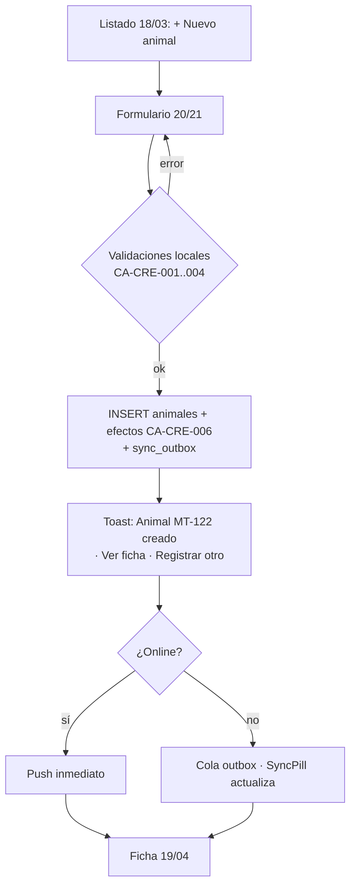
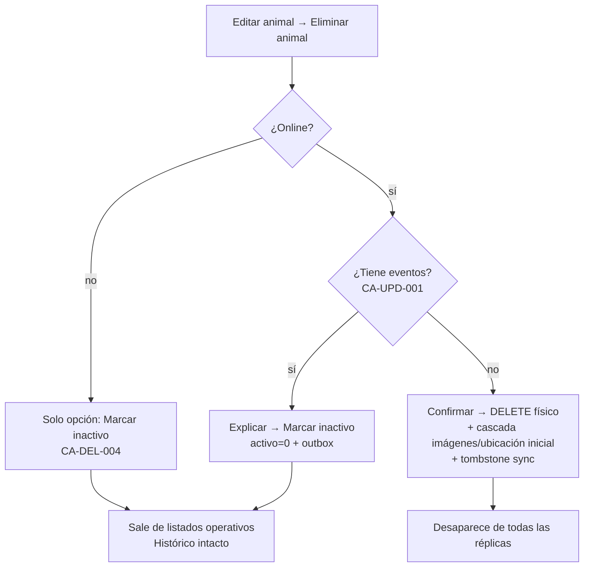

# GanaWeb — Especificación CRUD Animales (v1.5)

> Especificación de implementación para desarrolladores y agentes de IA.
> Referencias normativas: `arquitectura_funcional.md` (reglas RN/TR/PE),
> `schema_v3_corregido.sql` (estructura — los nombres de columna aquí son
> los REALES del esquema), `especificaciones_tecnicas.md` (capas, sync,
> tests), pantallas 03/04/18/19/20/21 del `.op`.
> Reglas propias de este flujo: **CA-xxx** (citables en tests y PRs).
> Ante contradicción con los documentos base: reportar (IA-001), no resolver.

---

## 0. Alcance

Casos de uso cubiertos: `crearAnimal`, `actualizarAnimal`, `eliminarAnimal`
(decide físico vs inactivar), `reactivarAnimal`, `adjuntarImagenAnimal`,
`marcarImagenPrincipal`, `eliminarImagenAnimal`, `obtenerFichaAnimal`
(incluye timeline). Los EVENTOS del animal (pesos, servicios, vacunas…)
NO son parte de este CRUD — son casos de uso propios (§4 arquitectura
funcional); aquí solo se consumen para el timeline y la regla de borrado.

## 1. Extensión de esquema requerida (mínima)

El esquema YA modela imágenes correctamente (v1.2): `imagenes` es la tabla
GENERAL de archivos de la aplicación y `animales_imagenes` es la tabla
puente animal↔imagen (con único `(animal_id, imagen_id)`). Este diseño es
reutilizable: otras entidades futuras se vinculan con su propia tabla
puente sin tocar `imagenes`. Solo se requieren dos columnas nuevas:

```sql
-- La foto principal es un atributo DEL VÍNCULO, no de la imagen
ALTER TABLE animales_imagenes ADD COLUMN es_principal INTEGER NOT NULL DEFAULT 0;
-- Trazabilidad de quién subió el archivo (PE-006)
ALTER TABLE imagenes ADD COLUMN usuario_creado_por TEXT REFERENCES usuarios(id);

-- v1.1: auditoría inmutable de borrados físicos (CA-DEL-009)
CREATE TABLE auditoria_eliminaciones (
    id TEXT PRIMARY KEY,
    finca_id TEXT NOT NULL REFERENCES fincas(id),
    entidad TEXT NOT NULL DEFAULT 'animal',
    entidad_codigo TEXT NOT NULL,
    entidad_resumen TEXT,
    usuario_id TEXT NOT NULL REFERENCES usuarios(id),
    dispositivo_id TEXT,
    via TEXT NOT NULL CHECK (via IN ('permiso','autoservicio')),
    created_at TIMESTAMPTZ NOT NULL DEFAULT CURRENT_TIMESTAMP
);
```

`animal_id` queda nullable: la tabla sigue disponible para otras entidades
a futuro. `finca_id` ya existe y se llena SIEMPRE (partición del sync).

## 2. Permisos (catálogo §1.2 de arquitectura funcional)

| Operación | Permiso |
|---|---|
| Ver listado / ficha / timeline / imágenes | `animales:ver` |
| Crear (incluye adjuntar imágenes al crear) | `animales:crear` |
| Editar datos / imágenes / foto principal / reactivar | `animales:editar` |
| Inactivar / reactivar | `animales:inactivar` |
| Eliminar FÍSICO | `animales:eliminar` (v1.1 — permiso propio; semilla: solo Administrador) o la regla de autoservicio CA-DEL-008 |

Toda server function revalida permiso + pertenencia del animal a una finca
del usuario (PE-002/PE-003). El `fincaId` de la URL nunca se confía.

## 3. CREATE — `crearAnimal`

### 3.1 Campos obligatorios (el mínimo viable de campo — capturar rápido)

| Campo (columna real) | Obligatorio | Regla |
|---|---|---|
| `codigo` | **Sí** | Único por finca, comparación case-insensitive y sin espacios extremos (CA-CRE-001). Máx 20 chars |
| `sexo_key` | **Sí** | 0=Macho, 1=Hembra, 2=Pajuela (config_key_values) |
| `tipo_ingreso_id` | **Sí** | 0=Nacido en finca, 1=Comprado |
| `fecha_nacimiento` | **Sí** si nacido en finca | No futura (RN-002). Si comprado y se desconoce: estimable (ver 3.2) |
| `fecha_compra` | **Sí** si comprado | No futura; ≥ fecha_nacimiento si ambas existen |
| `finca_id` | **Sí** (implícito) | La finca activa; jamás editable después |

Todo lo demás es **opcional al crear** (nombre, raza, arete, RFID, QR,
madre/padre, color vía comentarios, hierro, propietario, calidad, ubicación,
peso, tatuado/herrado/descornado, numero_pezones, comentarios). Filosofía:
en campo se registra el ternero con código y sexo; el resto se completa
después. La ficha muestra qué falta, no bloquea.

### 3.2 Reglas de creación

- **CA-CRE-001** — Unicidad de `codigo` por finca. Offline se valida contra
  la réplica local; el conflicto global se resuelve en sync (RN-060: el
  segundo va a bandeja de revisión, nada se pierde).
- **CA-CRE-002** — Condicionales por origen: *Nacido en finca* habilita
  `madre_id`/`padre_id`(o `codigo_pajuela`); *Comprado* habilita
  `fecha_compra`, `precio_compra`, `peso_compra` y lugar de compra. Los
  campos del modo no elegido se guardan vacíos/0 (defaults del esquema).
- **CA-CRE-008 · Apto para monta (v1.4)** — `es_de_monta` (integer 0/1)
  solo puede ser 1 si `sexo_key`=0 (Macho); en hembras y pajuelas el
  sistema fuerza 0 aunque el cliente envíe otra cosa. Es el flag que
  RN-011 exige para validar un servicio de tipo `monta`: el `padre_id`
  debe apuntar a un macho EN_FINCA con `es_de_monta=1`. Editable con
  `animales:editar` (un novillo puede ascender a reproductor).
- **CA-CRE-003** — Parentesco: `madre_id` debe ser hembra de la misma
  finca; `padre_id` macho (o `codigo_pajuela` si `tipo_padre_key`=IA);
  ninguno puede ser el propio animal. Advertencia (no bloqueo) si la madre
  tendría <24 meses al nacimiento de la cría.
- **CA-CRE-004** — Fecha de nacimiento desconocida (compra): la UI ofrece
  "estimar por edad" (ej. "≈ 3 años" → fecha calculada al día 1 del mes);
  se anota `[fecha estimada]` en `comentarios`.
- **CA-CRE-005** — Valores iniciales fijados por el sistema, NUNCA por el
  cliente: `estado_animal_key=0` (EN_FINCA), `salud_animal_key=0` (Sano),
  `categoria_reproductiva` = `novilla` (hembra) / `no_aplica` (macho o
  pajuela) según TR del §2 AF, `ind_descartado=0`, `activo=1`, `version=1`,
  `usuario_creado_por` = usuario autenticado (PE-006).
- **CA-CRE-006** — Efectos colaterales (misma transacción + outbox, T-002):
  1) si se capturó ubicación → fila inicial en `animales_ubicacion_historico`;
  2) si se capturó peso → fila en `pesos` con `tipo_peso` = `nacimiento` o
  `compra` según origen; 3) imágenes adjuntadas → §6.
- **CA-CRE-007** — Disponible offline al 100% (UUID generado en cliente).

### 3.3 Flujo de proceso (crear)



"Registrar otro" conserva raza, ubicación y tipo de ingreso (captura en
serie de terneros).

### 3.4 Especificación de UI del formulario (v1.3 — OBLIGATORIA)

> Motivo de esta sección: la primera implementación renderizó inputs de
> texto libre para campos de catálogo (Sexo mostraba el key numérico "1")
> y fusionó la ubicación en un solo control. **El agente NO improvisa
> controles**: cada campo usa EXACTAMENTE el control de esta tabla, con
> los componentes de `packages/ui` + shadcn/ui y el layout de las
> pantallas 20 (desktop, card centrada de 2 columnas) y 21 (mobile,
> apilado con footer pegajoso). Si un campo no aparece aquí: preguntar
> (IA-001).

| Campo | Control EXACTO | Fuente de datos | Comportamiento |
|---|---|---|---|
| Código * | Input texto | — | Mayúsculas automáticas, máx 20, sin espacios; en edición: disabled si tiene eventos (RN-001) con hint |
| Nombre | Input texto | — | Placeholder "Ej: Lucero" |
| Nº de arete | Input texto | — | — |
| RFID | Input texto + ícono lector | — | El lector BLE/NFC escribe aquí (§5 AF) |
| Sexo * | **Select** (3 opciones) | `config_key_values` opcion='sexo' | Mostrar SIEMPRE el texto (Macho/Hembra/Pajuela), guardar el value numérico. PROHIBIDO exponer el key. En mobile: pills segmentadas (pantalla 21) |
| Raza | **SelectConCreacion** buscable | `config_razas` activo=1 | Último ítem del dropdown: "+ Crear nueva raza" → mini-form inline (patrón creación contextual) |
| Fecha de nacimiento * | **DatePicker** | — | Formato dd/mm/aaaa (es-CO), máximo hoy (RN-002); atajo "estimar por edad" (CA-CRE-004) |
| Color | **SelectConCreacion** | `config_colores` activo=1 | Cada opción con swatch del `codigo` hex junto al nombre |
| Calidad | **Select** | `config_calidad_animal` activo=1 | — |
| Apto para monta | **Switch** (`es_de_monta`, integer 0/1) | — | Visible SOLO si sexo=Macho (CA-UI-008). Default 0. Marca al toro reproductor: RN-011 valida contra este flag |
| Origen * | **Pills segmentadas** (2) | tipo_ingreso 0/1 | "Nacido en finca" / "Comprado" — controla la visibilidad condicional CA-CRE-002. JAMÁS input ni select |
| Madre | **Combobox buscable** | `animales`: sexo=Hembra, misma finca, activo=1, EN_FINCA | Opciones "código · nombre"; excluye al propio animal; visible solo en "Nacido en finca" |
| Padre | **Combobox buscable** + toggle Monta/IA | machos `es_de_monta` o `codigo_pajuela` | Visible solo en "Nacido en finca" |
| Fecha de compra * / Precio / Peso compra / Lugar | DatePicker · Input numérico es-CO · Input numérico · SelectConCreacion `lugares_compras` | — | Visibles SOLO en "Comprado" (CA-CRE-002) |
| Potrero | **Select** | `potreros` finca activa, activo=1 | **CUATRO selects SEPARADOS** — jamás un campo combinado |
| Sector | **Select** | `sectores` finca activa, activo=1 | Independiente del potrero (sin cascada: `sectores` solo tiene `finca_id` en el esquema) |
| Lote | **Select** | `lotes` finca activa, activo=1 | Independiente |
| Grupo | **Select** | `grupos` finca activa, activo=1 | Independiente |
| Comentarios | Textarea | — | — |
| Imágenes | Uploader (cámara/galería) | §6 | Miniaturas + estado de subida |

Reglas de UI (citables):

- **CA-UI-001** — Ningún key/id numérico o UUID llega a la vista: todo
  campo de catálogo muestra su texto y persiste su key/id. Ver "1" en
  pantalla es un bug de esta regla.
- **CA-UI-002** — Todo select de maestro con permiso `configuracion:crear`
  disponible termina en "+ Crear nuevo" (creación contextual, componente
  `SelectConCreacion`); sin el permiso, la opción no aparece.
- **CA-UI-003** — Potrero, Sector, Lote y Grupo son 4 controles separados
  e independientes (opcionales todos). El label combinado
  "Potrero/Sector/Lote/Grupo" está prohibido.
- **CA-UI-004** — Los selects cargan desde la réplica local (funcionan
  offline); un maestro vacío muestra dentro del dropdown el EmptyState
  con el link "+ Crear el primero" (mismo permiso de CA-UI-002).
- **CA-UI-005** — El hint "Se sincronizará al recuperar señal" del footer
  aparece SOLO sin conexión (es una nota `info`, pantallas del sistema);
  con conexión no se muestra nada. Mostrarlo estando "Sincronizado" es
  contradictorio y es un bug.
- **CA-UI-006** — Botón Guardar: estado de carga "Guardando…" que
  conserva el ancho; deshabilitado si el formulario no valida. Cancelar
  con confirmación solo si hay cambios sin guardar.
- **CA-UI-008** — El switch "Apto para monta" se muestra únicamente con
  sexo=Macho; al cambiar el sexo a Hembra/Pajuela el valor se descarta
  (no viaja oculto al submit). En el Combobox de Padre (§3.4) las opciones
  se filtran por `es_de_monta=1` cuando el servicio es de monta natural.
- **CA-UI-007** — Los campos condicionales de Origen se montan/desmontan
  con el toggle; al cambiar de modo, los valores del modo abandonado se
  descartan (no viajan ocultos al submit).

### 3.5 Distribución y layout del formulario (v1.5 — NORMATIVA)

> Motivo: la implementación previa produjo un muro plano de 22 campos en
> dos columnas rígidas, sin secciones, con parejas arbitrarias ("Nº de
> pezones / Hierro") y la ubicación al final. Esta sección define la
> **distribución obligatoria**. El agente no reordena ni reagrupa campos
> por su cuenta; si un campo nuevo no encaja en ninguna sección: preguntar
> (IA-001).

#### 3.5.1 Principio

El formulario se organiza en **4 secciones visibles** + **1 bloque
colapsable** de detalles. Con esto la vista inicial pasa de 22 a **10
campos**: el 90 % de las altas se completan sin abrir el colapsable, que
es exactamente la filosofía del §3.1 (capturar rápido en campo, completar
después).

#### 3.5.2 Orden y contenido de las secciones (desktop, pantalla 20)

Card única centrada, `max-w-[720px]`, título "Nuevo animal" / "Editar
MT-xxx" y la nota "* obligatorio" alineada a la derecha del título.

| # | Sección (encabezado) | Campos | Grilla |
|---|---|---|---|
| 1 | **IDENTIFICACIÓN** | Código *, Nombre, Nº de arete | `1fr 1.4fr 1fr` |
| 2 | **CARACTERÍSTICAS** | Sexo *, Raza, Fecha de nacimiento * — luego Color, Calidad | `1fr 1fr 1.2fr` + `1fr 1fr` |
| 3 | **ORIGEN** | Pills Nacido/Comprado, luego condicionales (§3.5.4) | pills 260px + `1fr 1fr` |
| 4 | **UBICACIÓN** | Potrero, Sector, Lote, Grupo | `1fr 1fr 1fr 1fr` (una sola fila) |
| — | **▸ Detalles adicionales** (colapsable) | §3.5.3 | `1fr 1fr` interno |

Encabezado de sección: `text-caption font-semibold uppercase
tracking-wide text-muted-foreground`, separación `space-y-6` entre
secciones. **Los anchos de columna son proporcionales al contenido**: está
prohibido el grid de 2 columnas fijas para todo el formulario (produce
parejas sin relación semántica y campos de 1 dígito con ancho de textarea).

#### 3.5.3 Bloque "Detalles adicionales" (colapsable)

Contiene lo secundario, en este orden: **RFID**, **Tipo de explotación**,
**Propietario**, **Hierro**, **Nº de pezones**, los switches **Tatuado /
Herrado / Descornado / Es de monta** (agrupados en una fila propia de
switches, nunca intercalados entre inputs) y **Comentarios** (textarea a
ancho completo, siempre el último campo del formulario).

- **CA-UI-009** — Colapsado por defecto al CREAR. Al EDITAR, se abre
  automáticamente si algún campo interno tiene valor, y el encabezado
  muestra el conteo: "Detalles adicionales · 4 con datos". Nunca oculta
  información existente sin avisar.
- **CA-UI-010** — Un campo con error de validación fuerza la apertura del
  bloque y recibe el foco: el usuario jamás ve "revisa el formulario" con
  el error escondido dentro de un colapsable.

#### 3.5.4 Reglas de composición

- **CA-UI-011** — La sección ORIGEN muestra SOLO los condicionales del
  modo activo (CA-CRE-002): *Nacido en finca* → Madre, Padre;
  *Comprado* → Fecha de compra, Precio, Peso de compra, Lugar de compra.
  Los campos del modo inactivo se desmontan (CA-UI-007).
- **CA-UI-012** — "Es de monta" vive en el colapsable y aparece solo con
  sexo = Macho (CA-UI-008). Con Hembra/Pajuela no se renderiza.
- **CA-UI-013** — "Estimar por edad" (CA-CRE-004) **no** es un botón fijo
  junto al campo de fecha: es un atajo DENTRO del popover del calendario
  ("¿No sabes la fecha? Estimar por edad"). Un botón permanente compite
  visualmente con el campo que acompaña.
- **CA-UI-014** — Obligatorios visibles: solo **Código**, **Sexo**,
  **Origen** y **Fecha** llevan asterisco (§3.1). Marcar cualquier otro
  campo como obligatorio —Tipo de explotación incluido— es un bug.
- **CA-UI-015** — Footer sticky de la card: "Cancelar" a la izquierda,
  "Guardar animal" primario a la derecha; el hint de sincronización solo
  offline (CA-UI-005).

#### 3.5.5 Estilos: solo tokens del sistema (confirmado v1.5)

- **CA-UI-016** — La redistribución es **estructural, no estética**: se
  cambian agrupación y grillas, NUNCA la apariencia de los controles.
  Todo color, radio, sombra, tipografía y espaciado sale de los tokens ya
  definidos (`ganaweb-design.md` + `ganaweb-estilos.md`), aplicados con
  las utilidades del sistema:
  - Colores: `bg-card`, `text-foreground`, `text-muted-foreground`,
    `border`, `bg-primary`, `text-primary-foreground`. **Prohibido**
    cualquier hex literal, `style={{...}}` con color, o variante `dark:`
    (T-004).
  - Radios y sombras: `rounded-card`, `rounded-lg`, `--shadow-card`.
    Nunca valores en píxeles escritos a mano.
  - Tipografía: `text-title` (título de la card), `text-caption
    font-semibold uppercase tracking-wide` (encabezado de sección),
    `text-support` (labels y valores), `.num` en campos numéricos.
  - Espaciado: múltiplos de 4 (`gap-2`/`gap-3` en grillas, `space-y-6`
    entre secciones, `p-4`/`p-5` en la card).
  - Alto de controles: 38-40px desktop / 48px mobile; touch mínimo 44px
    (invariante del catálogo de estilos).
- **CA-UI-017** — Los controles se toman de `packages/ui` y shadcn/ui
  (Input, Select, Combobox/`SelectConCreacion`, DatePicker, Switch,
  Textarea, Collapsible). No se crean variantes locales del formulario:
  si un control necesita algo que no ofrece, se extiende en
  `packages/ui` para todo el sistema (IA-003).
- **CA-UI-018** — Verificación obligatoria: el formulario debe verse
  correcto en **los 10 temas** (5 estilos × claro/oscuro) sin ajustes
  específicos. Si un tema requiere un parche, el problema está en los
  tokens, no en el formulario.

#### 3.5.6 Mobile (pantalla 21)

**Mismas secciones, mismo orden, mismo colapsable** — paridad total con
desktop para no enseñar dos formularios distintos. Diferencias propias del
formato:

- Una sola columna; campos de 48px de alto; la sección UBICACIÓN apila sus
  4 selects (no fila de 4).
- Sexo y Origen como **pills segmentadas** a ancho completo (más rápidas
  con guantes que un select).
- Footer pegajoso con "Guardar animal" a ancho completo; "Cancelar" es la
  ✕ del header.
- Los encabezados de sección permanecen: son la única guía de posición en
  un scroll largo.

## 4. READ

### 4.1 Listado (pantallas 18 desktop / 03 mobile)

- Filtro base SIEMPRE: `finca_id = finca activa` AND `activo = 1` AND
  `estado_animal_key = 0` (EN_FINCA). Toggle "Incluir vendidos/muertos" y
  "Ver inactivos" (este último solo con `animales:inactivar`).
- Búsqueda sobre: `codigo`, `nombre`, `codigo_arete`, `codigo_rfid` (lector
  BLE/NFC escribe aquí — §5 AF).
- Filtros: categoría reproductiva, salud, potrero, lote. Orden default:
  `codigo` asc. Numéricas alineadas a la derecha, filas 44px,
  virtualización desde 100 filas.

### 4.2 Ficha (19 desktop / 04 mobile) — incluye TIMELINE

**Timeline (CA-TL-001..004):**

- **CA-TL-001 · Fuentes** — UNION de: `pesos`, `servicios`, `palpaciones`,
  `partos` (como madre), `partos_crias` (nacimiento propio),
  `producciones_lacteas`, `aplicaciones_sanitarias`,
  `revisiones_veterinarias`, `animales_ubicacion_historico`,
  `animales_condicion_corporal`, `ventas`, `muertes`, y las altas de
  `imagenes` (§6). Cada ítem: dominio (color/ícono §2 estilos), título,
  meta, fecha, usuario.
- **CA-TL-002 · Orden** — `fecha` desc, desempate `created_at` desc. Se
  excluyen filas de registros grupales anulados (RN-051).
- **CA-TL-003 · Paginación** — 20 ítems por página ("Ver N eventos más"),
  agrupación visual por año cuando el rango supera 12 meses.
- **CA-TL-004 · Encabezado de ficha** — badges desde los caches
  (`categoria_reproductiva`, `salud_animal_key`); si el animal está
  VENDIDO/MUERTO o `activo=0`, banner de estado permanente arriba y las
  acciones de evento se ocultan.

## 5. UPDATE — `actualizarAnimal`

- **CA-UPD-001** — Mismo formulario 20/21 en modo edición. Editables: todo
  lo capturable del §3 EXCEPTO:
  - `codigo`: inmutable si el animal "tiene eventos" (RN-001). Definición
    exacta de *tener eventos*: existe ≥1 fila que lo referencia en
    cualquiera de las fuentes de CA-TL-001 (excluyendo la ubicación inicial
    y las imágenes) O es `madre_id`/`padre_id`/`donadora_id` de otro animal.
    El formulario lo muestra deshabilitado con hint "El código no se puede
    cambiar: el animal tiene N eventos".
  - `finca_id`, `estado_animal_key`, `categoria_reproductiva`,
    `salud_animal_key`, `ind_descartado`: JAMÁS editables aquí — cambian
    solo por eventos (TR-001/TR-010) o por la acción de descarte.
  - Ubicación (`potrero/sector/lote/grupo_id`): NO editable en el
    formulario tras la creación — se cambia con el evento MoverUbicacion
    (deja histórico). El form la muestra como solo-lectura con link
    "Mover animal".
- **CA-UPD-002** — Concurrencia optimista con la columna `version`: el
  update exige la versión leída; en conflicto (editado en otro dispositivo)
  → recargar y re-aplicar, informando al usuario. En sync aplica RN-061.
- **CA-UPD-003** — `updated_at` y outbox en cada cambio; disponible offline.

## 6. Imágenes del animal

- **CA-IMG-001 · Límites** — Máximo **5 imágenes activas** por animal.
  Formatos de entrada: JPEG/PNG/WebP/HEIC (cámara). El cliente comprime
  ANTES de guardar: lado mayor 1600px, WebP calidad 0.8, objetivo ≤ 1 MB
  (`tamano_bytes` real). Sin video.
- **CA-IMG-002 · Captura** — Fuentes: cámara o galería, desde la ficha
  (galería en tab Resumen) y desde el formulario de creación. En UNA
  transacción: fila en `imagenes` (`finca_id`, `ruta`, `nombre_original`,
  `mime_type` final image/webp, `tamano_bytes`, `descripcion` opcional,
  `usuario_creado_por`) + fila de vínculo en `animales_imagenes`. El
  "máximo 5" de CA-IMG-001 cuenta vínculos ACTIVOS del animal.
- **CA-IMG-003 · Principal** — `es_principal` vive en el VÍNCULO
  (`animales_imagenes`): el primer vínculo del animal queda `es_principal=1`
  automáticamente; cambiable con `marcarImagenPrincipal` (transacción:
  desmarca el anterior del mismo animal). La principal es el avatar del
  animal en listados. Máximo un principal activo por animal (invariante
  verificable).
- **CA-IMG-004 · Almacenamiento** — `ruta` = `fincas/{finca_id}/imagenes/
  {imagen_id}.webp` (la ruta NO incluye al animal: `imagenes` es tabla
  general y un archivo podría vincularse a otras entidades) en el volumen
  de la app (Docker volume,
  respaldado junto a la BD). El acceso se sirve autenticado (verifica
  `usuarios_fincas`), nunca como estático público. Puerto `AlmacenArchivos`
  en `aplicacion` — S3-compatible es un adaptador futuro sin tocar casos
  de uso.
- **CA-IMG-005 · Offline** — El blob se guarda en OPFS y la fila viaja por
  una **cola de binarios separada** del outbox de datos (los binarios no
  bloquean el sync de eventos). La UI muestra la imagen local de inmediato
  con badge "pendiente de subir". Al reconectar: sube blob → confirma fila.
- **CA-IMG-006 · Timeline** — Cada alta genera ítem de timeline (dominio
  manejo): "Foto agregada" + thumbnail.
- **CA-IMG-007 · Borrado** — Se DESVINCULA: `animales_imagenes.activo=0`
  (la fila de `imagenes` no se toca). Si el vínculo era principal, el
  siguiente activo más antiguo del animal hereda `es_principal`. Un job
  server-side purga blob + fila de `imagenes` cuando lleva ≥30 días sin
  ningún vínculo activo en ninguna tabla puente.

## 7. DELETE — `eliminarAnimal` (físico) vs inactivar

Regla de producto (la tuya, formalizada):

- **CA-DEL-001** — La **eliminación física** procede si y solo si el animal
  NO "tiene eventos" según la definición exacta de CA-UPD-001 (cero filas
  en las fuentes del timeline, sin crías ni rol de madre/padre/donadora).
  Los vínculos de `animales_imagenes` y la fila de ubicación inicial NO
  bloquean: se eliminan en cascada dentro de la misma transacción (las
  filas de `imagenes` quedan huérfanas y las purga el job de CA-IMG-007).
  Es el caso "lo creé por error".
- **CA-DEL-002** — Si tiene eventos → **inactivación**: `activo=0` +
  outbox. El histórico queda íntegro y consultable; el animal desaparece
  de listados operativos y selects.
- **CA-DEL-003** — UNA sola acción en la UI ("Eliminar animal", zona
  inferior del modo edición). El **servidor decide** cuál de las dos
  aplica según eventos Y permisos del usuario, y el diálogo lo comunica
  (si solo puede inactivar, esa es la única opción que ve):
  - Sin eventos → "Se eliminará definitivamente MT-122. Esta acción no se
    puede deshacer." [Cancelar / Eliminar]
  - Con eventos → "MT-122 tiene 14 eventos registrados y no puede
    eliminarse. Puedes marcarlo como inactivo: se oculta de la operación y
    conserva su historia." [Cancelar / Marcar inactivo]
- **CA-DEL-004** — La eliminación FÍSICA es **solo online** (la
  verificación de referencias debe ser global — un evento capturado en
  otro dispositivo sin sincronizar no es visible localmente). Offline, el
  botón ofrece únicamente inactivar. La inactivación sí funciona offline.
- **CA-DEL-005** — El delete físico genera un tombstone en el protocolo de
  sync para que las réplicas locales de otros dispositivos lo purguen.
- **CA-DEL-006** — Semántica de `activo=0`: SOLO depuración/captura
  errónea. Las salidas reales del hato son eventos `ventas`/`muertes`
  (TR-001/TR-002) y mantienen `activo=1`. Prohibido inactivar como atajo
  de venta — el diálogo lo recuerda si el usuario no ha registrado salida.
- **CA-DEL-008 · Autoservicio de errores (v1.1)** — Además del permiso
  `animales:eliminar`, puede eliminar físicamente quien cumpla TODO:
  (a) tiene `animales:crear`, (b) es el `usuario_creado_por` del animal,
  (c) el animal fue creado hace < 24 horas, (d) no tiene eventos
  (CA-DEL-001). Es el patrón "borra tu propio error reciente": el
  mayordomo corrige su duplicado sin esperar al administrador. Se valida
  SIEMPRE en servidor.
- **CA-DEL-009 · Auditoría del borrado físico (v1.1)** — En la misma
  transacción del DELETE se inserta una fila de auditoría inmutable:
  `{animal codigo y nombre, finca_id, usuario, fecha, dispositivo_id,
  via: 'permiso'|'autoservicio'}`. El registro desaparece; la traza de
  quién lo eliminó, jamás. (Tabla `auditoria_eliminaciones` — migración
  junto a la de imágenes del §1.)
- **CA-DEL-007** — `reactivarAnimal` (permiso `animales:editar`) revierte
  la inactivación desde el listado con "Ver inactivos". Valida que el
  código no haya sido reutilizado; si lo fue → exige nuevo código.

### Flujo de decisión (eliminar)



## 8. Contratos de casos de uso (capa `aplicacion`)

| Caso de uso | Entrada (esencial) | Salida | Offline |
|---|---|---|---|
| `crearAnimal` | datos §3 + imágenes[] opcionales | animal + efectos | ✓ |
| `actualizarAnimal` | id, cambios, `version` leída | animal actualizado | ✓ |
| `eliminarAnimal` | id | `{resultado: 'eliminado'\|'inactivado'\|'requiere_confirmacion', eventos: N}` | solo inactivar |
| `reactivarAnimal` | id | animal | ✓ |
| `adjuntarImagenAnimal` | animalId, blob, descripcion? | imagen + vínculo (estado subida) | ✓ (cola binarios) |
| `marcarImagenPrincipal` | imagenId | ok | ✓ |
| `eliminarImagenAnimal` | imagenId | ok | ✓ |
| `obtenerFichaAnimal` | id, cursorTimeline? | ficha + página de timeline | ✓ (réplica) |

Cada caso de uso: valida permiso → reglas de dominio (CA/RN citables) →
escribe por puertos → outbox. Misma implementación corre en SQLite y
Postgres (suite de integración dual, TS de especificaciones técnicas).

## 9. Criterios de aceptación (mínimos para dar por cerrado el flujo)

1. Unit (TDD, dominio): un test por cada CA-xxx nombrándola en el
   `describe` (TS-001). Property test: crear→consultar→editar→eliminar
   físico deja la BD idéntica al estado previo (round-trip limpio).
2. Integración dual (SQLite y Postgres): `crearAnimal` con efectos
   CA-CRE-006; `eliminarAnimal` en ambas ramas; concurrencia CA-UPD-002.
3. E2E Playwright: (a) crear animal OFFLINE con foto → reconectar →
   verificar animal + imagen en servidor; (b) intentar eliminar animal con
   eventos → verifica diálogo de inactivación; (c) usuario Solo lectura no
   ve botones de crear/editar/eliminar (RBAC).
4. El timeline de un animal con >20 eventos pagina y agrupa por año.
5b. E2E de layout (v1.5): el formulario presenta las 5 secciones con sus
   encabezados; "Detalles adicionales" está cerrado al crear y abierto al
   editar un animal que tenga esos datos; solo 4 campos llevan asterisco;
   la ubicación es una fila de 4 selects (CA-UI-009..014).
5. E2E de layout (v1.5): el formulario muestra las 4 secciones con sus
   encabezados; la vista inicial expone 10 campos (el resto dentro del
   colapsable); la ubicación son 4 selects en una fila; al editar un
   animal con detalles, el bloque abre solo y muestra el conteo; un error
   dentro del colapsable lo abre y enfoca (CA-UI-009..015).
6. Revisión de estilos (v1.5): cero hex literales, cero `dark:`, cero
   `style={{}}` con color en el formulario; render correcto en los 10
   temas (CA-UI-016..018).
7. E2E de UI del formulario (v1.3): Sexo/Raza/Color/Calidad renderizan
   como select/combobox con textos (nunca keys); Origen son pills que
   conmutan los condicionales; la ubicación son 4 selects separados; el
   hint offline no aparece estando sincronizado (CA-UI-001..005/007).

## 10. Decisiones asumidas (ajustables — confirmar con producto)

1. Obligatorios mínimos = código + sexo + origen + fecha (§3.1). Alternativa
   estricta: exigir también raza y ubicación.
2. Máximo 5 imágenes por animal, compresión a WebP 1600px/≤1MB (CA-IMG-001).
3. ~~Permiso único~~ **RESUELTO v1.1**: el borrado físico usa el permiso
   propio `animales:eliminar` (semilla: solo Administrador) + la regla de
   autoservicio CA-DEL-008 + auditoría CA-DEL-009. Razón: inactivar es
   reversible, eliminar no — no comparten llave (mínimo privilegio).
